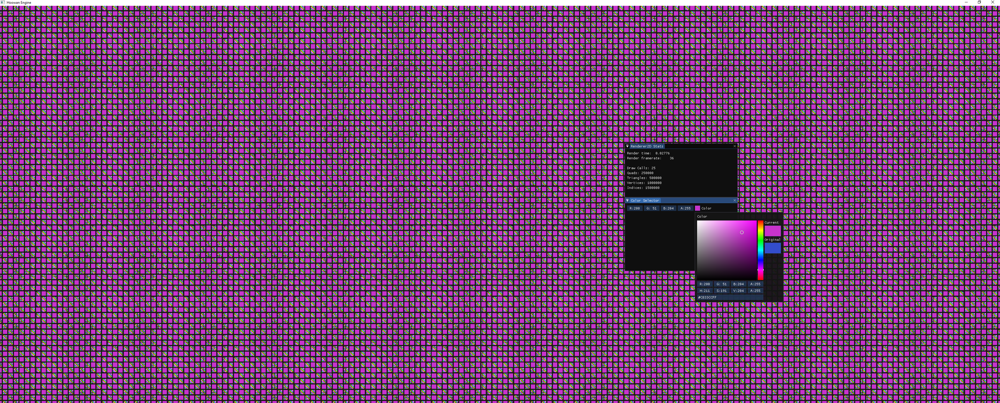
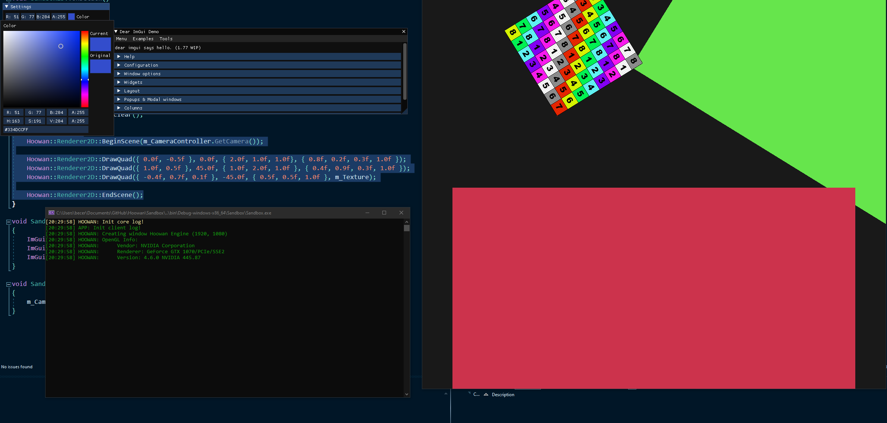
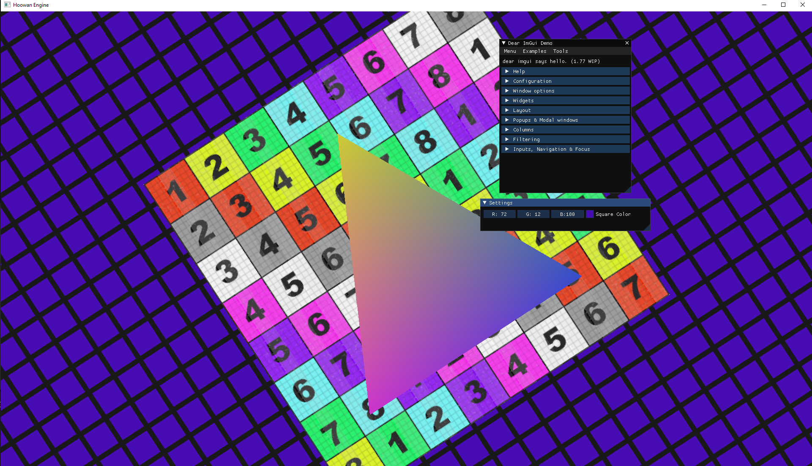
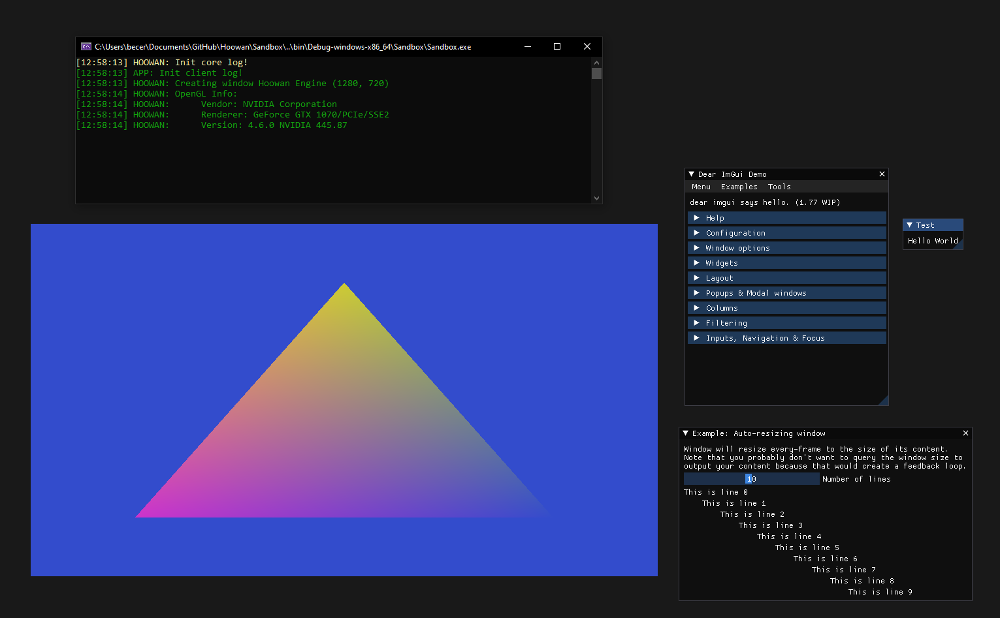

# Hoowan
Personal game engine project developed using C++ and OpenGL

# Overview
Hoowan is my game engine developed in C++ and OpenGL. I’m following “The Cherno’s” Game Engine development YouTube series in addition to following some design patterns from Jason Gregory’s “Game Engine Architecture”, Third Edition. This likely won’t become a huge commercial game engine (duh). This is mostly for me to learn more about C++ development, real-time rendering, and game engine architecture. I also hope to develop a basic game using this engine.

The Cherno's Game Engine YouTube series: https://www.youtube.com/playlist?list=PLlrATfBNZ98dC-V-N3m0Go4deliWHPFwT

Game Engine Architecture, Third Edition buy/rent: https://www.amazon.com/Engine-Architecture-Third-Jason-Gregory/dp/1138035459/ref=sr_1_2?dchild=1&keywords=game+engine&qid=1591651300&sr=8-2

# Usage

### To run Hoowan...
1. Clone this repository (NOTE: Hoowan only supports Windows x64 at the moment)
2. Download the latest version of Premake 5 (https://github.com/premake/premake-core) and place the executable under "../Hoowan/vendor/bin/premake"
3. Run the "GenerateProjects.bat" file to run premake and create a VS solution
4. Open the solution and compile the entire project
5. Run the Sandbox.exe to start the current compiled project (all customer code is written under the Sandbox solution)

### Instrumentation Usage
- Check Hoowan/src/Hoowan/Debug/Instrumentor.h for macro usage
- Output json files record function call times
- You can visualize these files by going to "chome://tracing" in a chrome browser and loading these files

# Log
### 07/09/2020 - Instrumentation, Statistics, and Batch Rendering

Haha engine go vroooom

In this update, I focused on optimizing my 2D renderer, which led me down the rabbit-hole of instrumentation and recording runtime statistics. Hoowan now has a preprocessor directive that records instrumentation stats, which can be pulled into the Chrome tracing app (more info in “Instrumentation Usage”). I also have an ImGui window that keeps track of the engine’s draw calls, vertex data, and framerate.

The biggest part of this update is the introduction of batch rendering. The 2D rendering API now allows users to specify a pre-allocated number of quads to batch together. This allows the engine to render several hundred (or even thousands) of quads in a single draw call, which significantly improves performance.

We’re getting closer to actually being able to make a game! In the next update, I’ll be focusing on sprite sheets and a basic entity-component system. At that point, I’ll put Hoowan to the test and attempt to make a basic 2D game!

### 07/03/2020 - Camera, Context, and 2D Rendering Abstractions

It's very simple if you don't think about it.

In this update, I made several more rendering abstractions so that I can focus on more advanced topics in my 2D renderer. I started by abstracting smaller components, like the camera controller, from the sandbox environment. I then did a bit of memory-management maintenance and cleaned a few bugs, such as resizing the window. From there, I abstracted 2D vertex data, transforms, textures, and shaders into their own 2D rendering classes. Now, drawing 2D quads is as simple as this:

```
Hoowan::Renderer2D::BeginScene(m_CameraController.GetCamera());

Hoowan::Renderer2D::DrawQuad({ 0.0f, -0.5f }, 0.0f, { 2.0f, 1.0f, 1.0f}, { 0.8f, 0.2f, 0.3f, 1.0f });
Hoowan::Renderer2D::DrawQuad({ 1.0f, 0.5f }, 45.0f, { 1.0f, 2.0f, 1.0f }, { 0.4f, 0.9f, 0.3f, 1.0f });
Hoowan::Renderer2D::DrawQuad({ -0.4f, 0.7f, 0.1f }, -45.0f, { 0.5f, 0.5f, 1.0f }, m_Texture);

Hoowan::Renderer2D::EndScene();
```

(I’m essentially feeding the renderer translation, rotation, scale, and either an RGBA or a texture object).
I now feel very comfortable in optimizing my renderer, so I’ll be moving onto profiling, instrumentation, and batch rendering for the next update.

### 06/24/2020 - Object Transformations, Delta Time, and Material System

Officially graduated from just rendering a single Dorito!

In this update, I abstracted more OpenGL/GLFW components in order to keep the sandbox environment clean. Hoowan now keeps track of object vertex and shader data internally, so users can focus on just supplying vertices and GLSL code. From there, users can apply position, scaling, quaternion rotations, and shear transformations (assuming the vertex shader takes in a proper model matrix). In addition, these components can change over time now that the Sandbox environment is exposed to a global DeltaTime variable. In addition to all of this, I created a shader file parser (so we don’t have to write shader source inline). The shader compiler also dynamically handles uniforms, so it’s pretty easy to upload texture bitmaps.

For the next update, I’ll be focusing on making a proper 2D renderer for simplified draw calls.

### 06/21/2020 - Hello, Abstraction!

This took way too much code…

In this update, I set up an empty C++ project with an engine and corresponding sandbox solution. I imported several APIs and libraries, including spdlog for console logging, GLFW for setting up the OpenGL rendering context and input handling, Glad for load generating, glm for an OpenGL math library, and imgui for in-app user interface customization. Then came the monstrous task of abstracting all of these elements away for use by the sandbox environment…

However, I’m very happy with the result. The current configuration allows me to focus on the fun stuff, like cameras, transforms, and materials systems. I hope to actually be able to make a basic 2D game within the next few updates!
