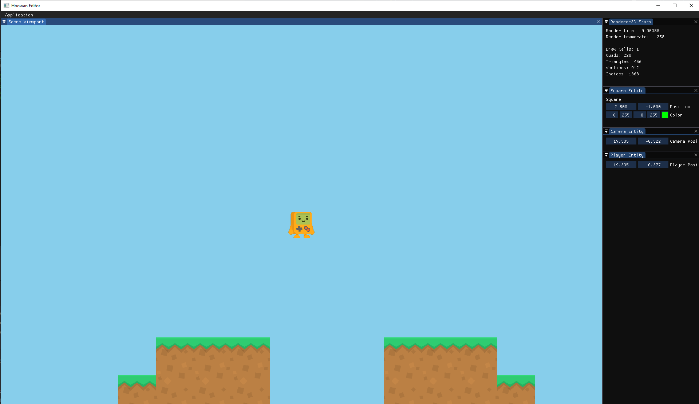
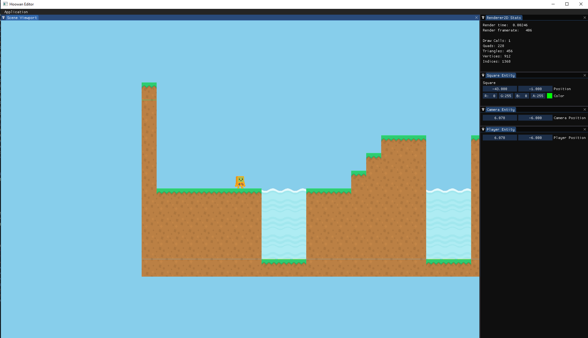
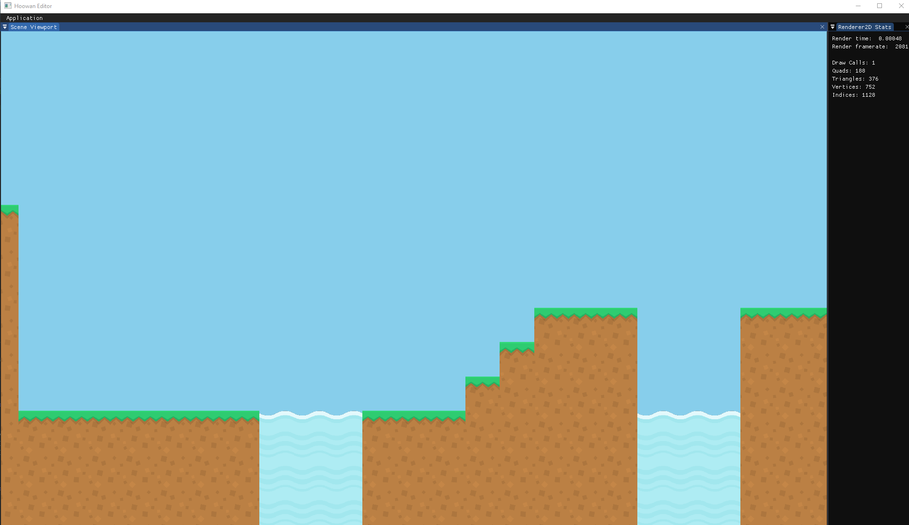

# Hoowan
Personal game engine project developed using C++ and OpenGL

# Overview
Hoowan is my game engine developed in C++ and OpenGL. I’m following “The Cherno’s” Game Engine development YouTube series in addition to following some design patterns from Jason Gregory’s “Game Engine Architecture”, Third Edition. This likely won’t become a huge commercial game engine (duh). This is mostly for me to learn more about C++ development, real-time rendering, and game engine architecture. I also hope to develop a basic game using this engine.

The Cherno's Game Engine YouTube series: https://www.youtube.com/playlist?list=PLlrATfBNZ98dC-V-N3m0Go4deliWHPFwT

Game Engine Architecture, Third Edition buy/rent: https://www.amazon.com/Engine-Architecture-Third-Jason-Gregory/dp/1138035459/ref=sr_1_2?dchild=1&keywords=game+engine&qid=1591651300&sr=8-2

# Usage

### To run Hoowan...
1. Clone this repository (NOTE: Hoowan only supports Windows x64 at the moment)
2. Run the "GenerateProjects.bat" file to run premake and create a VS solution
3. Open the solution and compile the entire project
4. Run Sandbox.exe to start the current compiled project (all customer code is written under the Sandbox solution)

### Instrumentation Usage
- Check Hoowan/src/Hoowan/Debug/Instrumentor.h for macro usage
- Output json files record function call times
- You can visualize these files by going to "chome://tracing" in a chrome browser and loading these files

# Log
### 09/06/2020 - Box2D, Kinematics, and Native Scripting

F = ma, but 142 times more complicated

Long time, no see! I haven’t been able to work on the engine much with my new job and starting up class again, but I’ve successfully managed to abandon my old physics engine in favor of Box2D (turns out collision detection is easy, but collision correction is HARD).
Box2D now allows users to add static and dynamic collision components to entities, which in turn allows objects to move around the screen using velocity/force modifications. Dynamic objects can collide into static objects and bounce off as you would expect them to. Overall, I’m happy with the solution as I’m now able to focus on other aspects of the engine (including making an actual game).
In addition, I implemented native scripting, which allows users to attach scripting components written in C++ to entities, which contain dispatchable OnStart(), OnEnd(), and OnUpdate() functions that calls engine code. The demo currently runs through a native script component, and workflow for developing a game on the engine is now becoming easier.
For the next update, (whenever that happens) I will continue working on the “demo” game, since it will give me some insight on what to work on next. It will most likely involve an audio engine, scene start/end utilities, and general work-flow tools.

### 08/03/2020 - Entity-Component System, 2D Collision Handling, and the Player Actor

BONK. You shouldn't be inside this block.

In this update, I utilized the popular ECS library, EnTT (https://github.com/skypjack/entt), for my wrapped entity-component system. I can now treat objects in a scene as distinct entities with various types of components attached to them, like a tag, transform, sprite, camera, or collision volume. Speaking of collision, I also implemented a basic rectangle vs. rectangle collision system. It works by checking all static vs dynamic collision volumes for collisions. In the case of a collision, just before rendering, the dynamic component is moved to avoid objects clipping into other objects. It certainly isn’t perfect, as the correction can have undefined behavior in different framerates and there is no special partitioning to improve performance, but I think it’s an excellent first step.

To put the new ECS to the test, I started to work on a basic player class that can move using the A and D keys and jump using the spacebar. The entire scene acts as a large collision volume that prevents the player from falling through. This means that a basic game can finally be created! There’s still a lot of work to do, especially in terms of collision correction, but I’ll be making a basic platformer by the next update (this may be a bit as I’ll be heading back to school and starting an internship soon).

### 07/12/2020 - Sprite Sheets, Scene Viewport, and the Hoowan Editor

Call it an asset-flip, baby

In this update, I created a SubTexture class along with 2D renderer extensions. Essentially, Hoowan can now read data from sprite sheets and form basic scenes. These entities are also managed by the batch renderer, and texture data is shared between these individual objects when they are in a single batch data structure. I also added a new dockable scene viewport using the ImGui API, which I plan on slowly adding development tools to help out with workflow. I also started work on a test game, which includes a level parser. It’s pretty simply, as it just reads in level sprites/orientation via string literals, but it can be used in a pretty powerful way.

For the next update, I plan on creating a basic entity-component system, in addition to some basic collision and physics. We’re close to being able to make a basic 2D game!

### 07/08/2020 - Instrumentation, Statistics, and Batch Rendering

Haha engine go vroooom

In this update, I focused on optimizing my 2D renderer, which led me down the rabbit-hole of instrumentation and recording runtime statistics. Hoowan now has a preprocessor directive that records instrumentation stats, which can be pulled into the Chrome tracing app (more info in “Instrumentation Usage”). I also have an ImGui window that keeps track of the engine’s draw calls, vertex data, and framerate.

The biggest part of this update is the introduction of batch rendering. The 2D rendering API now allows users to specify a pre-allocated number of quads to batch together. This allows the engine to render several hundred (or even thousands) of quads in a single draw call, which significantly improves performance.

We’re getting closer to actually being able to make a game! In the next update, I’ll be focusing on sprite sheets and an editor/viewport interface.

### 07/03/2020 - Camera, Context, and 2D Rendering Abstractions

It's very simple if you don't think about it.

In this update, I made several more rendering abstractions so that I can focus on more advanced topics in my 2D renderer. I started by abstracting smaller components, like the camera controller, from the sandbox environment. I then did a bit of memory-management maintenance and cleaned a few bugs, such as resizing the window. From there, I abstracted 2D vertex data, transforms, textures, and shaders into their own 2D rendering classes. Now, drawing 2D quads is as simple as this:

```
Hoowan::Renderer2D::BeginScene(m_CameraController.GetCamera());

Hoowan::Renderer2D::DrawQuad({ 0.0f, -0.5f }, 0.0f, { 2.0f, 1.0f, 1.0f}, { 0.8f, 0.2f, 0.3f, 1.0f });
Hoowan::Renderer2D::DrawQuad({ 1.0f, 0.5f }, 45.0f, { 1.0f, 2.0f, 1.0f }, { 0.4f, 0.9f, 0.3f, 1.0f });
Hoowan::Renderer2D::DrawQuad({ -0.4f, 0.7f, 0.1f }, -45.0f, { 0.5f, 0.5f, 1.0f }, m_Texture);

Hoowan::Renderer2D::EndScene();
```

(I’m essentially feeding the renderer translation, rotation, scale, and either an RGBA or a texture object).
I now feel very comfortable in optimizing my renderer, so I’ll be moving onto profiling, instrumentation, and batch rendering for the next update.

### 06/24/2020 - Object Transformations, Delta Time, and Material System

Officially graduated from just rendering a single Dorito!

In this update, I abstracted more OpenGL/GLFW components in order to keep the sandbox environment clean. Hoowan now keeps track of object vertex and shader data internally, so users can focus on just supplying vertices and GLSL code. From there, users can apply position, scaling, quaternion rotations, and shear transformations (assuming the vertex shader takes in a proper model matrix). In addition, these components can change over time now that the Sandbox environment is exposed to a global DeltaTime variable. In addition to all of this, I created a shader file parser (so we don’t have to write shader source inline). The shader compiler also dynamically handles uniforms, so it’s pretty easy to upload texture bitmaps.

For the next update, I’ll be focusing on making a proper 2D renderer for simplified draw calls.

### 06/21/2020 - Hello, Abstraction!

This took way too much code…

In this update, I set up an empty C++ project with an engine and corresponding sandbox solution. I imported several APIs and libraries, including spdlog for console logging, GLFW for setting up the OpenGL rendering context and input handling, Glad for load generating, glm for an OpenGL math library, and imgui for in-app user interface customization. Then came the monstrous task of abstracting all of these elements away for use by the sandbox environment…

However, I’m very happy with the result. The current configuration allows me to focus on the fun stuff, like cameras, transforms, and materials systems. I hope to actually be able to make a basic 2D game within the next few updates!
